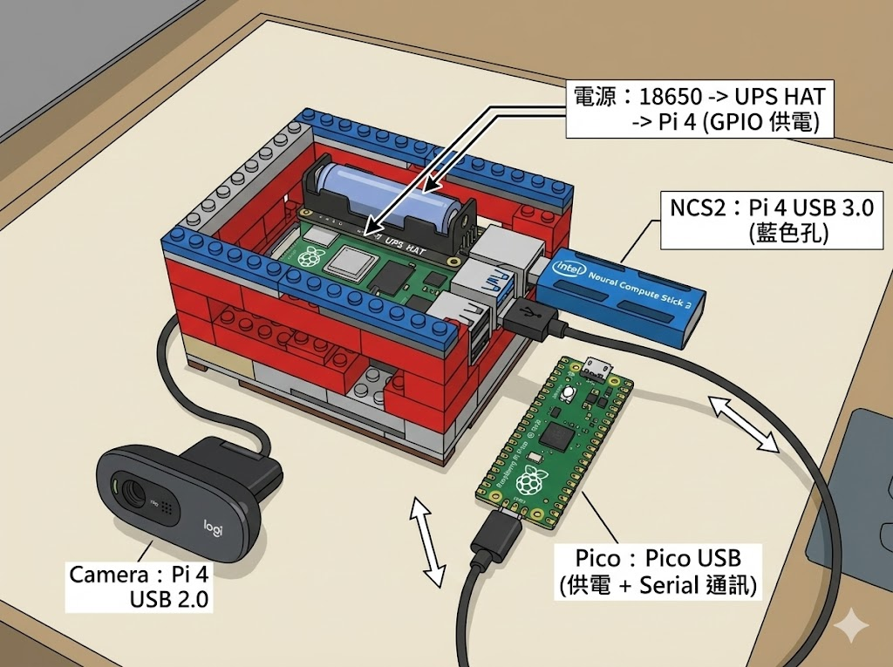
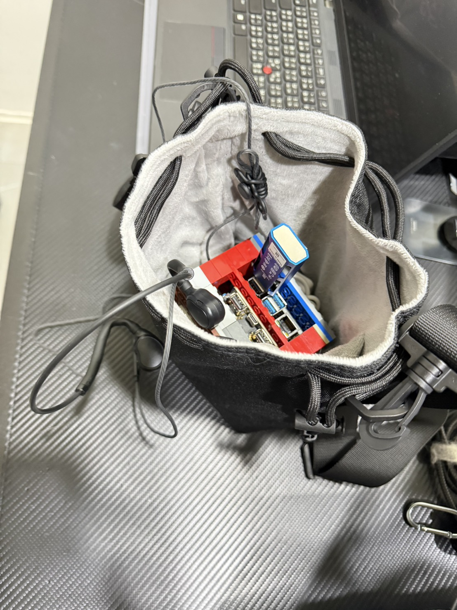
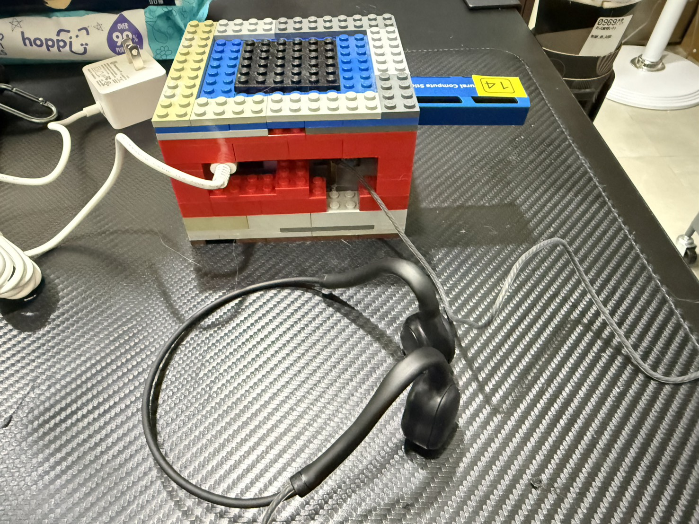
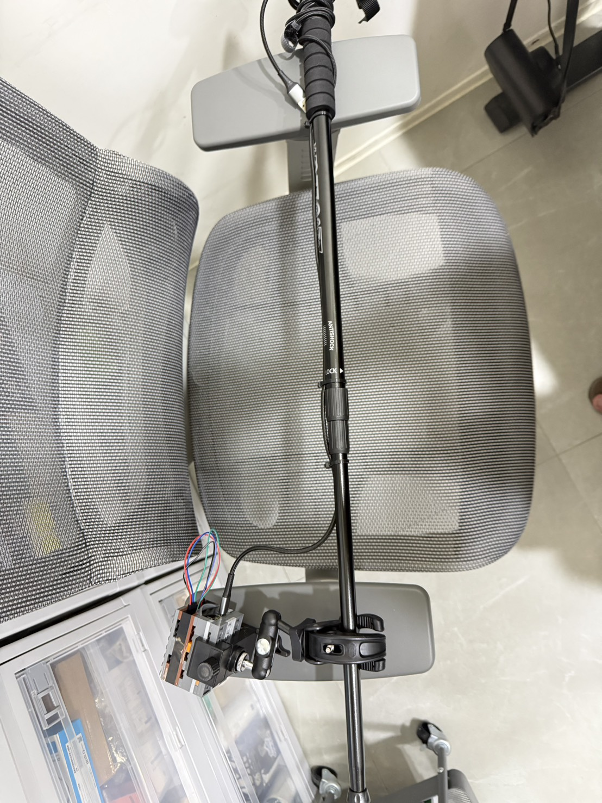
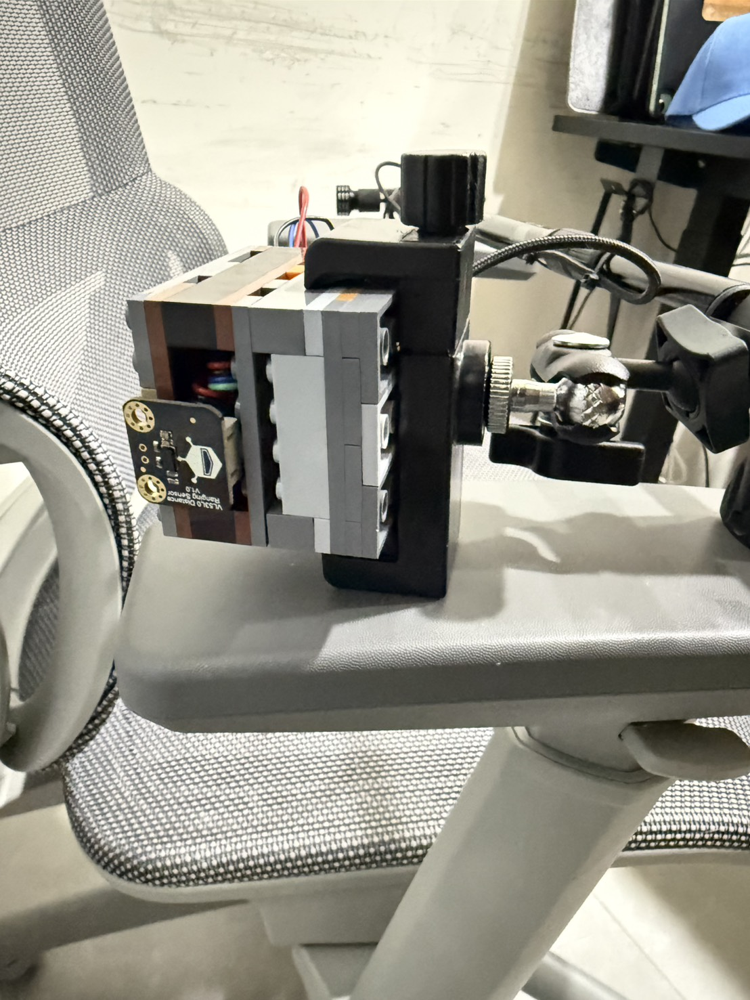
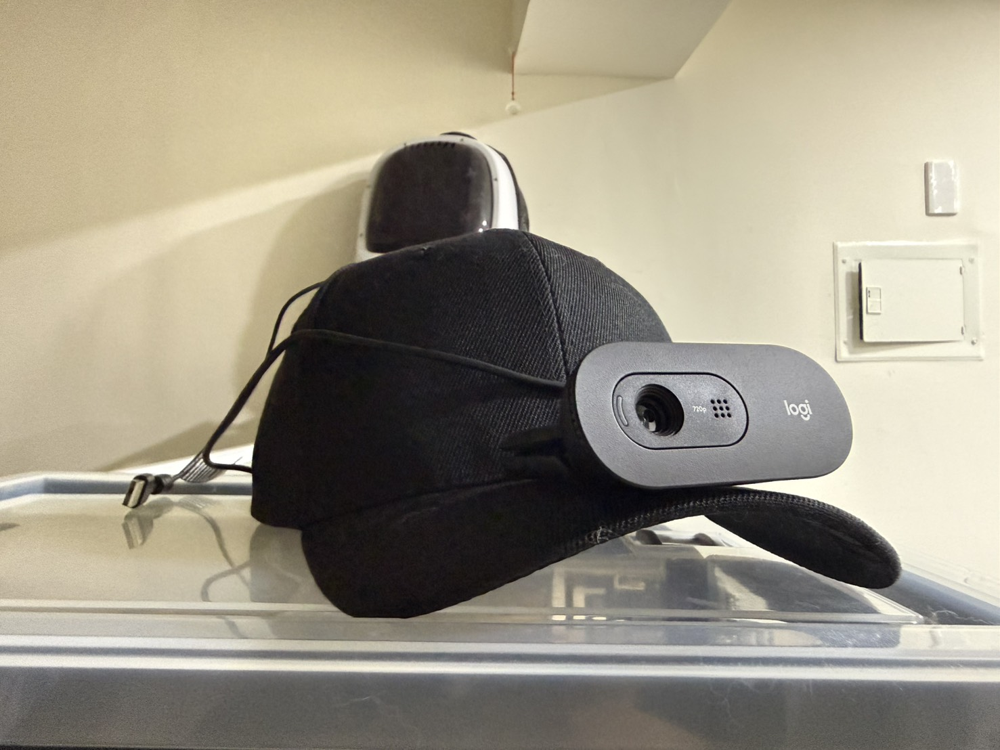
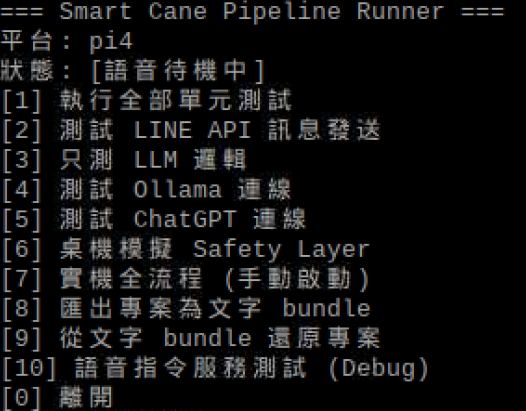
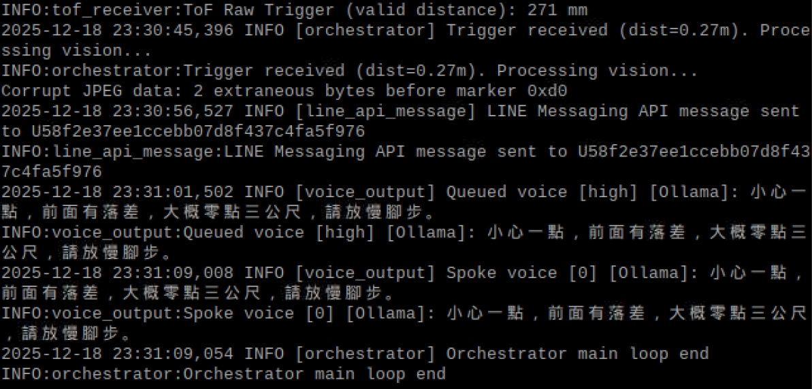
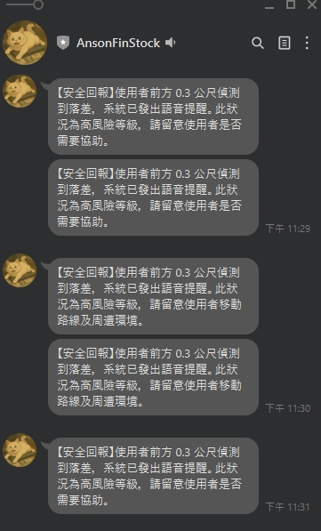

# 智慧導盲手杖 (Smart Cane) 專案總覽 (README)

> 本文件整合了專案規格、系統架構、部署指南與測試流程，為本專案的單一真理來源 (SSOT)。

## 1. 關於專案 (Overview)

### 1.1 專案簡介
* 一個整合 **IoT (Pico + ToF)**、**電腦視覺 (Pi4 + NCS2)** 與 **生成式 AI (Ollama LLM)** 的智慧輔助裝置。
* 具備「主動安全偵測」與「自然語言語音助理」功能，能即時回報前方障礙物、地面落差，並以真人語音 (Edge-TTS) 溫馨提醒。

### 1.2 專案緣由
* **改善視障者行動力**：解決傳統手杖無法偵測懸空障礙物 (如招牌) 或遠處地面坑洞的痛點。
* **科技結合公益**：將邊緣運算 (Edge AI) 應用於真實生活，打造低延遲、高隱私的離線輔助系統。

### 1.3 核心功能構想
* **視覺辨識**：即時偵測行人、車輛、椅子。
* **距離感測**：精準測量 2 公尺內障礙與地面高低差。
* **智慧理解**：利用 LLM (`gemma2:9b`) 重寫生硬數據，轉化為自然口語。
* **語音互動**：使用 Microsoft Edge-TTS 生成高擬真台灣口音語音。

---

## 2. 硬體架構與電路 (Hardware & Circuit)

### 2.1 物料清單 (BOM)

**主機端 (Raspberry Pi 4)**
| 品名 / 型號 | 用途 |
| ---------- | ---- |
| **Raspberry Pi 4 Model B (4GB)** | 核心大腦，執行 OS、AI 與 Logic |
| **Intel Movidius NCS2** | USB 加速棒，提升 OpenVINO 推論速度 5-10 倍 |
| **IMX179 (8MP) USB Camera** | 自動對焦鏡頭，負責影像輸入 |
| **USB 麥克風** | 接收語音指令 |
| **3.5mm 骨傳導耳機** | 播放警示音且不塞耳道 |
| **Pico UPS HAT** | 電源管理模組 (含 18650 電池) |

**拐杖端 (Pico + ToF)**
| 品名 / 型號 | 用途 |
| ---------- | ---- |
| **Raspberry Pi Pico 2 WH** | 微控制器，負責高速測距 |
| **GY-530 (VL53L0X)** | ToF 雷射測距模組 (範圍 3cm-2m) |
| **18650 鋰電池 x2** | 系統電力來源 |

### 2.2 電路接線圖 (Pinout)

**Pico <-> VL53L0X (I2C)**
| Pico Pin | VL53L0X Pin | 功能 |
|:---:|:---:|:---|
| GP4 | SDA | 資料傳輸 |
| GP5 | SCL | 時脈訊號 |
| 3V3 (Out) | VCC | 供電 |
| GND | GND | 接地 |


**Pi 4 <-> 周邊連接**
* **電源**：18650 -> UPS HAT -> Pi 4 (GPIO 供電)
* **Pico**：Pi 4 USB -> Pico USB (供電 + Serial 通訊)
* **NCS2**：Pi 4 USB 3.0 (藍色孔)
* **Camera**：Pi 4 USB 2.0



---

### 2.3 實體照片 (Hardware Photos)

**核心運算單元 (Core Unit)**
*(包含 Pi 4、UPS 電源與骨傳導耳機，整合於隨身包中)*





**手持感測拐杖 (Smart Cane)**
*(整合 Pico、ToF 測距儀與相機)*





**穿戴式裝置 (Wearable)**
*(代理視覺帽)*




---

### 2.4 示範影片 (Demo Video)

[](https://youtube.com/shorts/_2WLYP5ei2A?feature=share)

[點此觀看示範影片](https://youtube.com/shorts/_2WLYP5ei2A?feature=share)

---

## 3. 系統軟體架構 (Software Architecture)

### 3.1 專案結構
```text
smart_cane/
├─ pi4/                  # 主系統核心代碼 (Safety, LLM, Voice)
│   ├─ core/             # Config, Orchestrator, EventBus
│   ├─ safety/           # Vision (OpenVINO) & Cane (ToF) Client
│   ├─ llm/              # Ollama Client
│   └─ voice/            # Voice Control & Edge-TTS Output
├─ pico_firmware/        # Pico MicroPython 韌體
├─ models/               # AI 模型檔案
├─ docs/                 # 技術文件
├─ tools/                # 部署與測試工具
└─ run_pipeline.py       # 程式入口點
```

### 3.2 清理與 git 忽略清單
- 建議把測試／執行時產生的資料從版本序列中剔除：
   ```bash
   git clean -xdf data/analyze data/img logs __pycache__
   git checkout -- pi4/__pycache__ pi4/core/__pycache__ pi4/llm/__pycache__ pi4/safety/__pycache__ pi4/voice/__pycache__ tests/__pycache__
   git checkout -- logs/smart_cane.log                  # 若你不打算保留 log
   git checkout -- data/tof_simulated.json              # 若使用實體 ToF，不用 commit 這個模擬檔
   ```
- 建立 `.gitignore` 列出：`logs/`、`data/analyze/`、`data/img/`、`__pycache__/`、`*.pyc`、`*.log`，確保未來 `git status` 不會再提醒。  
- 若這些資料已經被 commit，先 `git rm --cached` 這些檔，再 `git push`。

### 3.3 核心模組設設計 (摘要)
* **Orchestrator (`orchestrator.py`)**：中央指揮官，訂閱 EventBus，整合視覺與距離事件，決策是否發出警示。
* **Vision Safety (`vision_safety.py`)**：載入 MobileNet-SSD 模型，偵測人/車/物。
* **LLM Client (`understanding_ollama_client.py`)**：
    * 負責 Prompt Engineering。
    * 接收 Event List -> 呼叫 Ollama (`gemma2:9b`) -> 產出自然語句。
* **Voice Output (`voice_output.py`)**：
    * 實作優先權佇列 (Priority Queue)。
    * 呼叫 `edge-tts` (Python subprocess) 生成 MP3 並播放。

### 3.4 關鍵程式碼實作 (Key Code Implementation)

**A. 核心指揮 (Orchestrator)**
*整合視覺、距離感測與語音的決策中樞 (pi4/core/orchestrator.py)*
```python
def _process_safety(self) -> None:
    # 1. 讀取 ToF 距離 triggers
    distance = tof_receiver.read_latest_distance()
    if distance is None: return

    # 2. 喚醒相機進行物件偵測
    frame = camera_capture.get_frame()
    camera_events = vision_safety.process_frame(frame)
    
    # 3. 結合 Safety Rules 判斷危險等級
    for event in camera_events:
        if event.severity in ("high", "critical"):
            # 4. 觸發語音與 LINE 通知
            voice_text = f"前方有 {event.label}，距離 {event.distance_m} 公尺"
            self.voice.speak(voice_text, priority="high")
            self.line_notifier.send(voice_text)
```

**B. 自然語言處理 (LLM Client)**
*將生硬警示轉化為溫柔語音 (pi4/llm/understanding_ollama_client.py)*
```python
def rewrite_voice_text(self, events, original_text):
    # 提示工程 (Prompt Engineering)
    system_prompt = "你是溫柔貼心的導盲志工...請用溫暖語氣提醒..."
    payload = {
        "model": "gemma2:2b",  # 自動使用輕量模型
        "messages": [{"role": "user", "content": original_text}]
    }
    # 呼叫 Ollama API
    response = requests.post(f"{OLLAMA_BASE_URL}/v1/chat/completions", json=payload)
    return response.json()['choices'][0]['message']['content']
```

**C. 語音輸出 (Voice Output)**
*優先權佇列與 Edge-TTS 整合 (pi4/voice/voice_output.py)*
```python
def speak(self, text, priority="mid"):
    # 使用 Heap Queue 實作優先權 (High 插隊, Low 排隊)
    heapq.heappush(self._queue, (_PRIORITY_MAP[priority], text))
    
    # 呼叫 Edge-TTS 生成高品質語音
    subprocess.run(["python3", "-m", "edge_tts", "--text", text, "--write-media", "/tmp/tts.mp3"])
    subprocess.run(["mpg123", "/tmp/tts.mp3"])
```

**D. 拐杖端韌體 (Pico Firmware)**
*ToF 測距與 JSON 串流 (pico_firmware/src/main.py)*
```python
while True:
    d = sensor.read()
    # 當距離小於 1.2公尺 時觸發
    if d > 0 and d < 1200:
        if utime.ticks_diff(now, last_trigger) > 2000:
            # 透過 USB Serial 傳送 JSON 給 Pi
            print(ujson.dumps({"event":"trigger", "d_mm": d}))
            last_trigger = now
    utime.sleep_ms(100)
```

---

## 4. 部署指南 (Deployment Guide)

> 這是從零開始在 Raspberry Pi 4 上架設本系統的標準流程。

### 4.1 系統準備
1. **Python 環境**：確保已安裝 Python 3.7+ (Pi OS Buster 預設為 3.7，建議使用虛擬環境)。
2. **安裝依賴套件**：
   ```bash
   sudo apt update
   sudo apt install mpg123 python3-pip git -y
   pip3 install edge-tts
   ```

### 4.2 安裝 Ollama 與模型
1. **安裝 Ollama**：參考 [ollama.com](https://ollama.com) 下載 Linux (ARM64) 版本。
2. **下載模型 (必須執行)**：
   ```bash
   ollama pull gemma2:9b
   ```
   *(註：Gemma2:9b 速度與品質平衡最佳，請勿使用 default 或過大模型)*

### 4.3 專案部署
1. 將專案複製到 `/home/pi/smart_cane_2`。
2. 建立 Python 虛擬環境並安裝依賴：
   ```bash
   python3 -m venv venv
   source venv/bin/activate
   pip install -r requirements.txt
   ```
3. **設定環境變數 (`.env`)**：
   複製 `.env.sample` 為 `.env`，確認：
   * `SMART_CANE_PLATFORM=pi4`
   * `OLLAMA_MODEL=gemma2:9b`
   * `TTS_ENGINE=edge-tts`

---

## 5. 執行與測試 (Execution)

### 5.1 啟動主程式
在專案根目錄執行：
```bash
python3 run_pipeline.py
```

### 5.2 選單功能說明

* **[1] 執行全部單元測試**：檢查程式邏輯正確性。
* **[4] 測試 Ollama 連線**：確認 LLM 服務是否活著。
* **[7] 實機全流程 (Production Mode)**：
    * 啟動 Safety Layer (Vision + ToF)。
    * 進入 Event-Triggered 模式 (有距離觸發才拍照)。
    * 整合 Edge-TTS 語音播報。

### 5.3 執行畫面預覽 (Operation Preview)

**1. 系統主選單 (Menu)** 
*(提供單元測試、連線測試與全流程執行選項)*



**2. 語音發送與 Console 監控** 
*(LLM 成功將「前方有坑洞」改寫為「溫柔導盲志工」風格)*



**3. LINE 照護者通知** 
*(手機端即時收到現場照片與文字回報)*




---

## 6. 常見問題與解決 (Troubleshooting)

1. **聲音難聽 / 機器人音**
   * 原因：使用了預設的 `espeak`。
   * 解法：確認已安裝 `edge-tts` 與 `mpg123`，且 `config.py` 中 `TTS_ENGINE="edge-tts"`。

2. **模型回應太慢 (>10秒)**
   * 原因：使用了過大的模型 (如 27b)。
   * 解法：執行 `ollama pull gemma2:9b` 並更新 config，速度可提升至 2-3 秒。

3. **連線逾時 (Timeout)**
   * 原因：WiFi 訊號不佳或 Ollama 服務卡死。
   * 解法：
     * 重啟 Ollama 服務 (`systemctl restart ollama` 或 Windows 重開)。
     * 在 `config.py` 增加 `OLLAMA_REWRITE_TIMEOUT_SEC` 至 30.0。

4. **Edge-TTS 找不到檔案**
   * 原因：`edge-tts` 安裝在 `~/.local/bin` 但不在 PATH 中。
   * 解法：使用 `python3 -m edge_tts` 方式呼叫 (程式碼已修正此問題)。

---

## 7. 未來展望

* **完全離線化**：評估在 Pi 5 上運行更輕量的 SLM (Small Language Model) 與 VITS 語音模型，擺脫網路依賴。
* **防水機構**：設計 IP65 等級的 3D 列印外殼。
* **多模態整合**：結合 VQA (Vision QA) 模型，讓使用者能詢問「前方是什麼店？」等更複雜問題。
