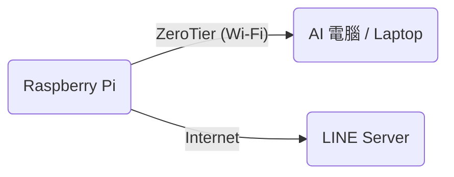

# 遠端 AI 架構修正說明 (V4)

感謝指正！如果是透過 **ZeroTier 連線到遠端 AI 電腦**，架構如下：



## 1. 解決延遲：請在「AI 電腦」上執行
Pi 只是負責發送請求，運算是在您的 AI 電腦上。
**27b 模型對一般電腦來說也相當吃力**，加上 ZeroTier 網路傳輸，造成了 20 秒的延遲。

請在 **AI 電腦** (有顯卡的那台) 開啟終端機執行：
```bash
ollama pull gemma2:2b
```
*(換成 2b 模型後，您的 AI 電腦運算會變快，Pi 收到的回應也會變快)*

## 2. 解決 LINE 429 錯誤：請在「Pi」上執行
我們剛才做的 `orchestrator.py` (非同步版) 修正依然非常重要，因為它能避免網路卡頓影響語音。
請務必確保 Pi 上的 `pi4/core/orchestrator.py` 是最新版。

接下來請在 **Pi 的終端機** 執行診斷：
```bash
python verify_line_token.py
```
*(這會測試 Pi 能不能連到 LINE Server，以及 Token 是否有效)*

## 3. 檢查 Pi 的 .env 設定
請檢查 Pi 上的 `/home/pi/smart_cane/.env` 檔案，確認 `OLLAMA_BASE_URL` 是指像 ZeroTier IP：
```env
# 範例 (請換成您 AI 電腦的 ZeroTier IP)
OLLAMA_BASE_URL=http://192.168.19x.xxx:11434
```
